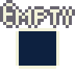
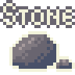
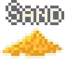
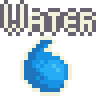
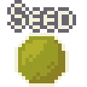
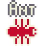
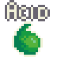
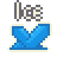

# GopherSand

GopherSand is a falling sand game written in [Golang](https://go.dev/) using the awesome [Ebitengine](https://ebitengine.org/) game engine. It is directly inspired by maxbittker's [sandspile](https://sandspiel.club/)

[](https://donbattery.github.io/gophersand/)  

The game is hosted on [GitHub Pages](https://donbattery.github.io/gophersand/) - click on the gif or the link to play the game in your browser.

## Features  

As with most games of this type, there is no real goal: you can't win or lose. The player places various materials into the world and watches them react with each other. Although each material follows a relatively simple set of rules, interesting behaviors can emerge from their combinations.

The game features 16 different materials (including the Empty 0 material), from which 10 can be directly put into the world by the player:  
 act as eraser, by default the whole world is empty  
  
 does not fall, and hard to react with  
  
 falls down and piles up, good soil for a **Seed**  
  
 falls down and spreads, plants love it  
  
 falls down and spreads a bit, if it gets in contact with **Sand** and **Water**, it turns into a **Root**  
  
 ant eggs are falling down, ants can climb and dig around creating **AntHills**, they eat plants and lay eggs  
  
 need to drink water and eat an ant to lay an egg  
  
 moves like water, dissolves most materials turning them into either **Smoke** or **Steam**  
  
 raises up and spreads, creating **Smoke**. It can turn flammable materials into more fire  
  
 stops most materials it touches, it melts over time creating cold **Water**  
  

The following 6 materials are product of reactions in the world:  
- **Smoke** raises up and spreads. **Fire** turns into smoke over some time  
- **Steam** raises up and spreads. It is created on smooth **Water** surface, or in wildfires. steam can condenses back to **Water**  
- **Root** is created from **Seed**, it tries to grow and search for **Sand** and **Water**, it can grow more root, or **Plant**  
- **Plant** is created by **Root** which is also feeding it. Plants can grow more plants, and sometimes **Flowers**  
- **Flower** has 4 petals and a **Seed** in the middle. If the seed falls out, the flower can grow another one  
- **AntHill** is created by ants from materials they can dig or eat trough themselves. AntHill is falling down, but does not spreads, it can support sand  

Beside directly putting materials into the world the player can **Generate** a new random world, or **Erase** the curren one by turning every non-empty material into fire. The game reacts to **orientation changes**, and rotates the world accordingly, creating this cool 90's liquid sand art effect (this behavior can be controlled from the **Menu**)  

## Controls  
The game can be controlled with: mouse / mouse + keyboard / touch:
- Click on a material to select it, only one material can be selected at a time
- You can also select Materials with 0-9 keys
- Place the material into the world with the **Left** mouse button, or touch (multi touch supported)
- Clear the area with the **Right** mouse button (this is the same if you would select Empty material, and use the left button / touch)  
- Change the size of the brush with the **Size** button or with the mouse **Wheel**  
- You can pause and resume the game with the **Start/Stop** button or the **P** key
- The **Gen** button opens the new world generator menu, the **G** key generates a new world
- The **Erase** button opens the erase dialog, the **E** button erases the world
- The **Menu** (hamburger) button opens the options menu  

### Motivation  
My motivation behind this project was to learn more about how to build a cellular automata, which is a bit more complex than Conway's Game of Life. I was experimenting with different solutions for "simulate" water in my 2d shooter, and found [Noita](https://store.steampowered.com/app/881100/Noita/) and [sandspile](https://sandspiel.club/) and decided to try to create a cell automata based sim. This is a smaller, simpler version of the "engine" I'm building for my desktop game, but I think it can stand on its own as a simple browser-based semi-idle experience.  

### Engine  
The "engine" is rather simple: I have a CellAutomata object which controls the 256x256 world. It has two flat arrays: one for Materials and one for pixels. Pixels are represented as 4 subsequent bytes (RGBA) in the array and used as a "source" for the texture. Materials are uint16 variables with the following mapping:
```text
Layout (LSB -> MSB):
	bits 0..3   : MaterialKind (0..15)
	bits 4..5   : MaterialLife (0..3)
	bits 6..7   : MaterialStatus (0..3)  0=Normal,1=Burned,2=Acidic,3=Frozen
	bits 8..15  : Material-specific state (8 bits)

State-byte canonical map (bits 8..15) may be used differently by different Materials:
	bit 8  : FaceLeft
	bit 9  : FaceUp
	bit 10 : FlagA
	bit 11 : FlagB
	bit 12 : FlagC
	bit 13 : FlagD
	bit 14 : FlagE
	bit 15 : FlagF
```  

We can calculate the index of each cell in the Material array, based on their x and y coordinates on the grid: `CellID = y * 256 + x`  

If we treat a Color as an uint32 variable, we can quickly set it in the pixel array by casting the corresponding area into an unsafe uint32 pointer: `*(*uint32)(unsafe.Pointer(&PixelArray[CellID * 4])) = uint32(Color)` To my current knowledge this is the fastest way to individually poke pixels before passing the whole array to the Ebitengine Image object.  

The cell automata divides the 256x256 world into 64 32x32 tiles, and uses a single uint64 variable as a bit-field to keep track of active tiles. Upon update the active tiles will be checked either in ascending or descending order (at random). A tile will be checked from left to right or from right to left at random, and it is always checked from bottom to top. There is an array with the same size as the world to keep track of the last tick a cell was processed. If we finish to process a cell we set the current tick in this array, so upcoming intents in the same update (from different materials), will detect that this cell was already processed in this update, and leave it alone. We do not need to clear this array, as we are only interested if the cell's entry is equals to the current tick or not.  

There is an array of MaterialProcessors, when a cell is being updated, the automata looks up its processor, if the material does not have a processor (nil entry in the array) it will be skipped (Empty and Stone is not processed), other materials will be processed with their own processor. The MaterialProcessors is responsible to "move" to material in the world, and report if it is potentially active. When a tile is updated, and even a single cell is potentially active, the whole tile will be marked as active for the next update. If potential activity detected on the edges, the appropriate neighbor(s) will also be marked as active for the next update.  
```Go
type MaterialProcessor func(
	ca *CellAutomata,
	kind MaterialKind,
	mat Material,
	cid, x, y int,
) bool
```  

When a MaterialProcessor "moves" a material it tries reactions in different directions. For example the Sand processor will try to react with the cell below, then if it failed to react, it choses a random direction and tries to react diagonally down. If it finds an Empty cell the reaction they will perform is Swap, so they will exchange position (this is how movement is done in this world). The automata has an array of MaterialReactions. To get the reaction between two material kinds we can use the following formula: `Reactions[MaterialKindA * 16 + MaterialKindB]`, if the entry is nil it means the two materials cannot react. The MaterialReaction function should report if the reaction was successful or not (some reactions have a chance to occur).  
```Go
type MaterialReaction func(
	ca *CellAutomata,
	matA, matB Material,
	cidA, cidB int,
) bool
```  

There is a concept of MaterialKindSets used to quickly filter for materials. With bitwise operations we can quickly decide if a Material is in a set:  
```Go
// MaterialKindSet is a 16-bit bit-field. Each bit indicates if the corresponding MaterialKind is part of the set.
type MaterialKindSet uint16

// NewMaterialKindSet creates a MaterialKindSet from a list of MaterialKind by setting the corresponding bits to 1.
func NewMaterialKindSet(kinds ...MaterialKind) MaterialKindSet {
	var set MaterialKindSet
	for _, k := range kinds {
		set |= (MaterialKindSet(1) << k)
	}
	return set
}

// IsIn returns true if the MaterialKind is in the given MaterialKindSet.
func (mk MaterialKind) IsIn(set MaterialKindSet) bool {
	return (set & (MaterialKindSet(1) << mk)) != 0
}

// IsIn returns true if the Material's Kind is in the given MaterialKindSet.
func (m Material) IsIn(set MaterialKindSet) bool {
	return m.GetKind().IsIn(set)
}
```  

### License  

the game is licensed under the MIT license, so you can use / modify / distribute it as you wish.  