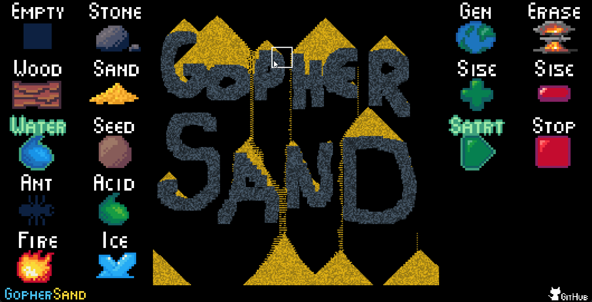

# GopherSand

GopherSand is a falling sand game written in [Golang](https://go.dev/) using the awesome [Ebitengine](https://ebitengine.org/) library.  

  

It is hosted on [GitHub Pages](https://donbattery.github.io/gophersand/) - click on the screenshot or the link to play the game in your browser

## Features

The game is currently under development and the subject of changes. Currently mouse and touch inputs are implemented, and a few keys.  

Currently only 4 material is available: empty, stone, sand and water.  

The game's page is responsive and should work on a wide variety of devices.

### License

the game is licensed under the MIT license, so you can use / modify / distribute it as you wish.